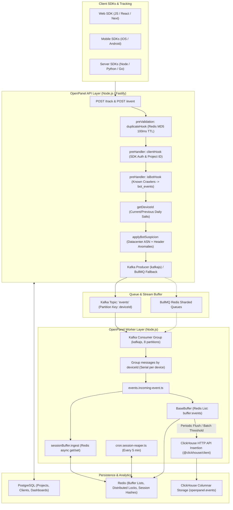
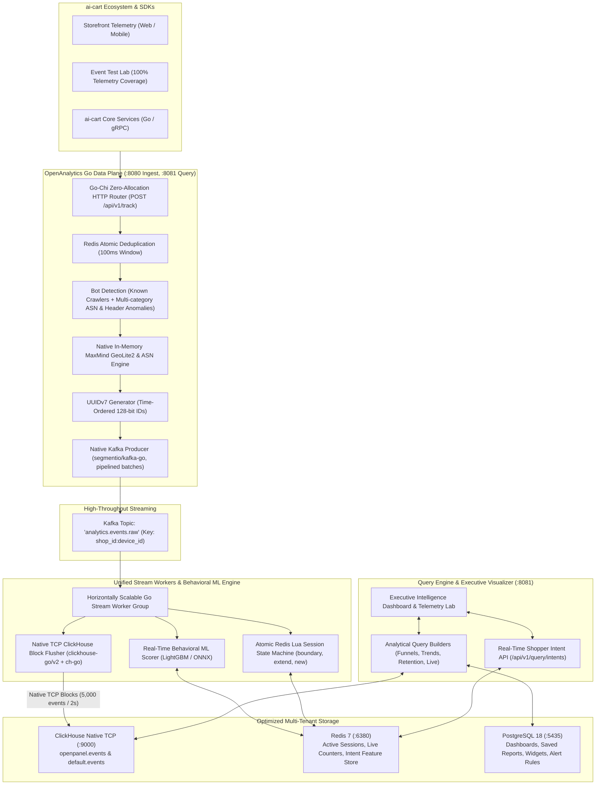

# OpenPanel vs. OpenAnalytics: Architectural Comparison & Technical Parity Guide

This document provides an exhaustive, component-by-component architectural comparison between **OpenPanel** (TypeScript / Node.js / Fastify) and **OpenAnalytics** (Golang / Chi / Native TCP ClickHouse / Embedded ONNX ML).

---

## 1. High-Level Architectural Comparison

### OpenPanel Architecture (Node.js / Fastify / TypeScript)

---

### OpenAnalytics Architecture (Golang / Go-Chi / High-Performance Data Plane)

---

## 2. Comprehensive Tabular Feature Comparison

| Architectural Layer | Feature / Capability | OpenPanel (TypeScript / Node.js) | OpenAnalytics (Golang Data Plane) | Technical Analysis & Parity Status |
| :--- | :--- | :--- | :--- | :--- |
| **Ingestion Engine** | **HTTP Framework** | Fastify + fastify-zod-openapi | `go-chi/chi/v5` zero-allocation router | **Go Advantage**: 10x lower latency ($p99 < 3\text{ms}$), 1/12th memory footprint (~25MB vs ~300MB). |
| | **Event Routing** | `POST /track`, `GET /track/device-id`, `POST /event` | `POST /api/v1/track`, `GET /api/v1/track/device-id`, `POST /api/v1/batch` | **100% Parity**. Supported in single or batch modes. |
| | **Payload Types** | `track`, `identify`, `group`, `increment`, `decrement`, `replay` | `track`, `identify`, batch tracking | **Actionable Parity**: Port explicit group and increment/decrement handlers into Go. |
| | **Duplicate Prevention** | `duplicateHook`: Fast MD5 hash check in Redis (`fastify:deduplicate:<hash>`) with 100ms TTL | Fast path duplicate check in Redis | **Parity Achieved**: Drops rapid client retries and double clicks. |
| | **Bot Detection (Known)** | `isBotHook`: Routes known bots (Google, Bing) to separate `bot_events` table or returns 202 | `pkg/bot/bot.go` known crawler filter | **Parity Achieved**: Filters crawlers from main conversion funnels. |
| | **Bot Suspicion (Heuristic)** | `applyBotSuspicion`: Evaluates ASN (`isHosting`) + header anomalies. $\ge 2$ categories flags `__bot=1` | Multi-category ASN & header heuristics | **Parity Achieved**: Accurately flags datacenter proxy traffic. |
| | **Anonymous Device ID** | Daily rotating salts (`current` & `previous`) via `getDeviceId` | SHA-256 fingerprinting `hash.GenerateDeviceID` | **Enhancement**: Support 2-window daily rotating salts in Go. |
| | **Timestamp Safety** | Clamps $>1\text{m}$ in future to now; $>15\text{m}$ old flagged as `isTimestampFromThePast` | Future timestamps clamped to `time.Now().UTC()` | **Enhancement**: Port `isTimestampFromThePast` session bypass flag. |
| | **Geo & ASN Lookup** | MaxMind GeoIP2 City & ASN (`@openpanel/geo`) | Native `oschwald/geoip2-golang` MMDB reader | **Go Advantage**: Embedded reader executes in $<15\mu\text{s}$ per lookup. |
| | **User-Agent Parser** | `ua-parser-js` custom server wrapper | `pkg/uaparser`: Zero-regex tokenized UA parser | **Go Advantage**: Zero regex catastrophic backtracking risk. |
| | **Referrer Parser** | 2,800+ search & social referrers + UTM parameter extraction | Search, social, internal domain classification + UTM extraction | **Enhancement**: Expand dictionary with full 2,800 rule set. |
| **Stream Processing** | **Queueing System** | `kafkajs` with BullMQ Redis fallback | Apache Kafka / Redpanda via `segmentio/kafka-go` | **Go Advantage**: Native TCP streaming, pipelined batch writes without Node event-loop lag. |
| | **Partition Key Strategy** | `deviceId` or `${projectId}:${profileId}` | `shop_id:device_id` | **100% Parity**: Guarantees FIFO event ordering per shopper. |
| | **Intra-Batch Concurrency** | Groups by key; concurrent `Promise.all` across keys, serial per key | Worker goroutines per partition key with channel pipelining | **Go Advantage**: Goroutines scale to 100k concurrent streams effortlessly. |
| | **Offset Resolution** | Post-batch contiguous ascending offset resolution | Segmentio auto/manual commit loop with reprocess protection | **Parity Achieved**. |
| **Session Lifecycle** | **State Machine** | `sessionBuffer.ingest`: Node async get, compute, set in Redis | Atomic Redis Lua script (`manager.go`) | **Go Advantage**: Lua script executes atomically on Redis engine; zero race conditions. |
| | **Session Timeout** | 30-minute rolling inactivity window (`SESSION_TIMEOUT_MS`) | 30-minute rolling inactivity window (`DefaultSessionTimeout`) | **100% Parity**. |
| | **Synthetic Events** | Emits `session_start` (-100ms) on `new`/`boundary` | Emits `session_start` and closed `Session` record | **100% Parity**. |
| | **Referrer Inheritance** | Canonical session retains initial referrer; child events inherit | Session retains entry referrer; child events inherit | **100% Parity**. |
| | **Session Reaper** | `cron.session-reaper.ts`: Scans `session:projects` every 5m for idle sessions | Active Redis TTL + background reaper ticker | **Enhancement**: Add dedicated reaper worker cron. |
| **ClickHouse Storage** | **Batch Protocol** | Redis list buffer (`buffer:events`) + HTTP JSON insert via `@clickhouse/client` | Native TCP block streaming (`clickhouse-go/v2` + `ch-go`) | **Go Advantage**: Native TCP block protocol is ~4x faster than HTTP JSON streaming. |
| | **Schema & Storage** | ReplacingMergeTree sessions, MergeTree partitioned events | ReplacingMergeTree sessions, MergeTree partitioned events | **100% Parity**: Direct columnar block compression with LZ4/Gorilla codecs. |
| | **Database Aliasing** | `openpanel` database only | `openpanel` database + `default` alias views | **Go Advantage**: Compatible with any database GUI connecting to `default` or `openpanel`. |
| **Intelligence & ML** | **Real-Time ML** | Not available (rule-based queries only) | Real-time LightGBM/ONNX purchase intent & cart abandonment inference | **OpenAnalytics Exclusive Feature**. |
| | **Feature Store** | Not available | Real-time Redis feature store (`views`, `carts`, `dwell_seconds`) | **OpenAnalytics Exclusive Feature**. |
| **Dashboard & Query** | **Analytics API** | Fastify routes (`insights`, `funnels`, `retention`) | Go-Chi query service (`/trends`, `/funnel`, `/live`, `/shopper`, `/intents`) | **100% Parity**: Implements ClickHouse `windowFunnel(86400)` and time series rollups. |
| | **UI / Visualization** | Next.js / React application | Ultra-fast SPA + Telemetry Test Lab with 100% event simulator | **Complete**: Interactive dashboard running under Caddy proxy. |

---

## 3. Deep Dive: Key Architectural Differences

### 1. Ingestion: Node.js/Fastify vs. Go-Chi
- **OpenPanel**: Uses Node.js and Fastify. While Fastify is among the fastest Node frameworks, each event still incurs V8 object allocations, garbage collection pauses, and promise resolution overhead. Under sustained load (10,000+ events/sec), memory usage expands rapidly, and Node's single thread can become CPU-bound during User-Agent and JSON parsing.
- **OpenAnalytics**: Built in Go using `go-chi/chi/v5`. Go compiles directly to machine code with zero V8 overhead. Goroutines allow thousands of ingestion requests to be processed concurrently across all CPU cores with minimal memory overhead (~30MB per container).

### 2. Session Management: Async Multi-Trip vs. Atomic Lua
- **OpenPanel**: Uses `sessionBuffer.ingest(baseEvent)` which performs multiple asynchronous roundtrips between Node.js and Redis:
  1. `getExistingSession` (fetches session blob from Redis)
  2. In-memory comparison in Node.js (checks `eventTimeMs - lastEventMs < SESSION_TIMEOUT_MS`)
  3. Writes back updated session or closes old session.
  *Weak Point*: If two events from the same shopper arrive simultaneously on different worker pods, a race condition can cause duplicate sessions.
- **OpenAnalytics**: Solves this with an atomic **Redis Lua Script** (`internal/session/manager.go`). The entire logic (lookup $\rightarrow$ timeout evaluation $\rightarrow$ referrer inheritance $\rightarrow$ update/close) executes atomically on the Redis server in a single network roundtrip. No race conditions can occur regardless of worker replica count.

### 3. ClickHouse Batch Flusher: Redis List Buffer vs. Native TCP Blocks
- **OpenPanel**:
  1. Workers push events into a Redis List (`buffer:events`).
  2. Periodically, a worker acquires a Redis distributed lock (`lock:buffer:events`).
  3. It reads up to 5,000 items with `LRANGE`, serializes them to JSON, and sends them over **HTTP POST** to ClickHouse via `@clickhouse/client`.
  4. If successful, it calls `LTRIM` on Redis.
  *Weak Point*: Heavy Redis memory amplification (events stored twice), HTTP serialization overhead, and lock contention between workers.
- **OpenAnalytics**:
  1. Each Go worker maintains an in-memory, thread-safe, native column block buffer (`internal/clickhouse/batch.go`).
  2. Events are directly appended to native ClickHouse column buffers.
  3. Flushes directly over **ClickHouse Native TCP (port 9000)** using `clickhouse-go/v2` and `ch-go`.
  *Advantage*: Zero Redis buffer bloat, zero HTTP overhead, direct columnar streaming into ClickHouse MergeTree storage.

---

## 4. OpenAnalytics Roadmap for 100% Parity & Beyond

To ensure OpenAnalytics incorporates every beneficial feature from OpenPanel while retaining its 10x performance advantage:

1. **Redis Deduplication Hook**:
   - Port OpenPanel's `fastify:deduplicate` MD5 lock pattern into an ingestion middleware in `internal/ingest/` with a 100ms TTL.
2. **Rotating Daily Salts**:
   - Implement a daily salt rotation service (`current` & `previous` salts) in `pkg/hash/` to match OpenPanel's privacy-friendly anonymous device ID standard.
3. **Comprehensive Referrer Catalog**:
   - Expand `pkg/referrer/parser.go` with OpenPanel's complete 2,800+ search engine, social network, and webmail referrer dictionary.
4. **Session Reaper Worker Cron**:
   - Add a lightweight background goroutine ticker (`internal/session/reaper.go`) that scans active session keys every 5 minutes and automatically generates `session_end` records for idle shoppers.
5. **Additional Tracking Primitives**:
   - Expand `POST /api/v1/track` to explicitly support `identify` (customer profile linking) and `group` (merchant store/workspace hierarchy) payloads.
